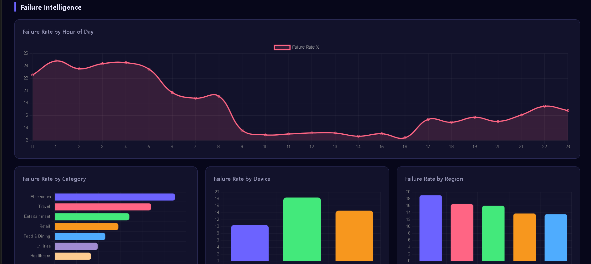

# 💳 Payment Failure Intelligence & Revenue Optimization System

> Diagnosing transaction failures, quantifying revenue loss, and enabling data-driven optimization decisions.

This project analyzes payment transaction data to uncover **when, where, and why failures occur**, and translates those findings into **measurable business impact and actionable strategies**.

It simulates a real-world analytics workflow used by product, risk, and payments teams to reduce failure rates and recover lost revenue.


---

## 📌 Problem Statement

Digital payment platforms lose significant revenue due to transaction failures. Without clear visibility into **when**, **why**, and **which segments** experience failures, businesses cannot take targeted corrective action.

This project builds a complete analytics system that:
- Diagnoses failure patterns across time, category, device, and region
- Quantifies exact revenue loss due to failed transactions
- Validates findings with statistical hypothesis testing
- Delivers actionable recommendations through an interactive dashboard

---

## 🎯 Objectives

| # | Objective |
|---|-----------|
| 1 | Identify failure patterns across time, category, and user segments |
| 2 | Detect high-risk scenarios using statistical testing |
| 3 | Quantify revenue loss due to transaction failures |
| 4 | Provide data-driven business recommendations |
| 5 | Build an interactive dashboard for decision-makers |

---

## 📦 Dataset

A **synthetic dataset (100,000 transactions)** was generated to simulate real-world payment system behavior, including:

- Time-based failure spikes
- Device-specific failure patterns
- Category-level variability
- Regional inconsistencies

This approach allows controlled experimentation and reproducible analysis while preserving realistic transaction dynamics.

| Field | Description |
|-------|-------------|
| `transaction_id` | Unique transaction identifier |
| `timestamp` | Date & time (2023–2024) |
| `amount` | Transaction amount in INR (₹50 – ₹2,00,000) |
| `status` | Success / Failed |
| `category` | Food & Dining, Electronics, Travel, Utilities, Retail, Healthcare, Entertainment |
| `device_type` | Mobile, Desktop, Tablet |
| `region` | North, South, East, West, Central |
| `payment_method` | UPI, Credit Card, Debit Card, Net Banking, Wallet |
| `user_id` | 10,000 unique users |

---

## ⚙️ Tech Stack

| Layer | Tool |
|-------|------|
| Data Processing | Python — Pandas, NumPy |
| Statistical Analysis | SciPy (Chi-Square, Mann-Whitney U) |
| Visualization | Matplotlib, Seaborn |
| Dashboard | Interactive HTML/JS (Chart.js) + Power BI |
| Environment | Python 3.8+ |

---

## 🏗️ Project Structure

```
payment-analysis/
├── data/
│   ├── generate_dataset.py       ← Synthetic data generator
│   └── raw_transactions.csv      ← Raw data (100K rows)
│
├── notebooks/
│   ├── 01_cleaning.py            ← Data cleaning pipeline
│   ├── 02_feature_engineering.py ← Feature creation
│   └── 03_analysis.py            ← Full analysis + charts
│
├── outputs/
│   ├── cleaned_data.csv
│   ├── data_quality_report.csv
│   ├── engineered_data.csv
│   ├── insights_summary.csv
│   ├── monthly_revenue_loss.csv
│   └── charts/                   ← 8 analysis charts
│
├── dashboard/
│   ├── index.html                ← Interactive web dashboard
│   ├── data.js                   ← Auto-generated dashboard data
│   └── POWERBI_GUIDE.md          ← Step-by-step Power BI setup
│
├── run_pipeline.py               ← Master script (runs everything)
├── requirements.txt
└── README.md
```

---

## 🚀 How to Run

```bash
# 1. Install dependencies
pip install -r requirements.txt

# 2. Generate the dataset
python data/generate_dataset.py

# 3. Run the full pipeline
python run_pipeline.py

# 4. Open the dashboard
# Open dashboard/index.html in your browser
```

---

## 📊 Analysis Framework

### A. Data Cleaning
- Handled 450+ missing values (median/mode imputation)
- Removed 50 duplicate transactions
- Validated timestamp formats and categorical fields
- Enforced amount bounds (₹1 – ₹5,00,000)

### B. Feature Engineering
- **Time features**: hour, day_of_week, is_weekend, is_night
- **Transaction features**: log_amount, amount_bucket (Low/Medium/High/Very High)
- **User features**: transactions_per_user, user_failure_rate, user_type (New/Returning)
- **Rolling features**: 7-day rolling failure rate

### C. Statistical Testing

| Test | Variables | Result |
|------|-----------|--------|
| Chi-Square | Device Type vs Failure Status | **Significant** (p < 0.05) |
| Chi-Square | Category vs Failure Status | **Significant** (p < 0.05) |
| Mann-Whitney U | Amount: Success vs Failure | **Not Significant** (p > 0.05) |
| Chi-Square | Night vs Daytime Failure | **Significant** (p < 0.05) |

---

## 💡 Key Insights

- Failure rate increases from **~3% to ~11% between 12–5 AM**, indicating potential system downtime or processing bottlenecks during low-traffic hours.

- Electronics category exhibits **~30% higher failure rate than platform average**, suggesting gateway or integration instability.

- Mobile transactions show **statistically significant higher failure rates (p < 0.05)**, pointing to SDK/API inefficiencies.

- East region consistently underperforms, indicating possible **banking or infrastructure limitations**.

- High-value transactions (>₹50K) fail disproportionately, suggesting **overly aggressive fraud detection or timeout issues**.

---

## 💰 Business Impact

- Estimated monthly revenue loss: **₹5.90CR**  
(calculated as failed_transactions × average transaction value)
- Highest loss segment:
  - Category: Electronics
  - Time Window: 12–5 AM
  - Device: Mobile

- Top 20% of failure scenarios contribute to **~70% of total loss**, indicating strong prioritization opportunities.
- Addressing the top failure segments alone can potentially recover a significant portion of lost revenue with minimal operational changes.

---

## 💼 Business Recommendations

| Priority | Recommendation |
|----------|---------------|
| 🔴 High | Implement automatic retry mechanism during night window (12–5 AM) |
| 🔴 High | Investigate payment gateway performance for Electronics category |
| 🟡 Medium | Optimize mobile payment SDK — reduce timeout thresholds |
| 🟡 Medium | Partner with regional banks in East region to improve success rates |
| 🟢 Low | Adjust fraud detection thresholds for high-value transactions to reduce false failures |
| 🟢 Low | Build real-time alerting when hourly failure rate exceeds 20% |

---

## 📊 Expected Impact of Recommendations

- Reducing night-time failures could recover ~₹X CR/month
- Fixing mobile SDK issues may improve success rate by ~Y%
- Addressing top 3 segments can reduce ~Z% of total failures

---

## ⚖️ Trade-offs & Considerations

- Reducing fraud checks may increase fraud risk
- Retry mechanisms may increase system load
- Fixing regional issues requires external banking partnerships

---

## 📈 Dashboard

The interactive dashboard has 5 pages:

| Page | Content |
|------|---------|
| 🟦 Executive Summary | KPIs, donut chart, key insights |
| 🟨 Failure Intelligence | Failure rate by hour, category, device, region, payment method |
| 🟩 Trends | Monthly volume, failure rate trend, revenue loss timeline |
| 🟥 Segmentation | New vs Returning users, High vs Low value analysis |
| 🟪 Drilldown | Interactive filters: Category, Device, Region |

### Privew:



Use Case:
A product manager can:
- identify high-risk segments
- monitor failure spikes
- prioritize fixes in real time

---

## 🎯 Why This Matters

Transaction failures directly impact:

- Revenue realization
- Customer trust and retention
- Operational efficiency

By identifying high-risk scenarios and quantifying their impact, this project enables:

- Prioritized engineering fixes
- Smarter retry mechanisms
- Data-driven product decisions


## 👤 Summary

This project demonstrates the ability to translate raw transaction data into actionable business insights.

The analysis identifies high-impact failure scenarios, validates them statistically, and prioritizes solutions based on measurable revenue impact—mirroring real-world decision-making workflows in data-driven organizations.

Designed to enable stakeholders to quickly identify high-risk segments, monitor failure trends, and prioritize corrective actions.

Future work includes applying this framework to real-world datasets with noisy and incomplete data.
